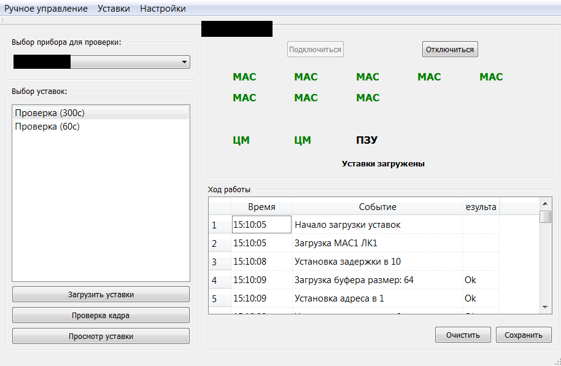
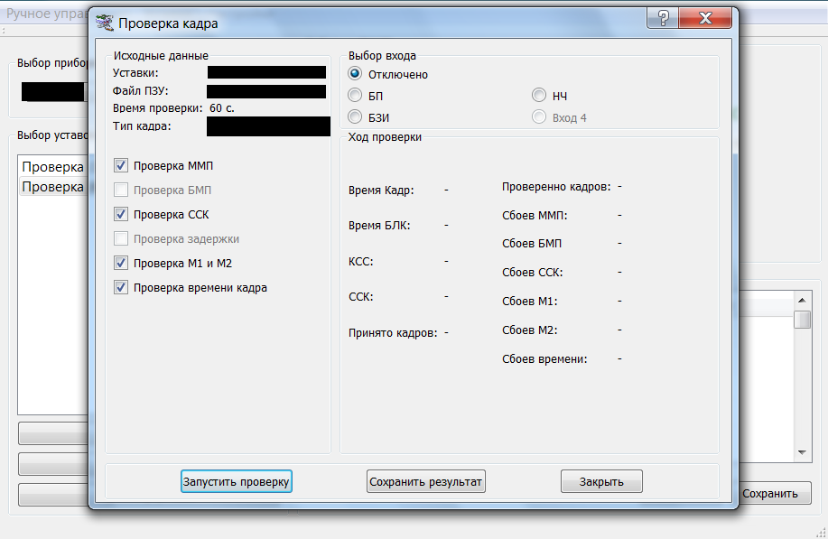
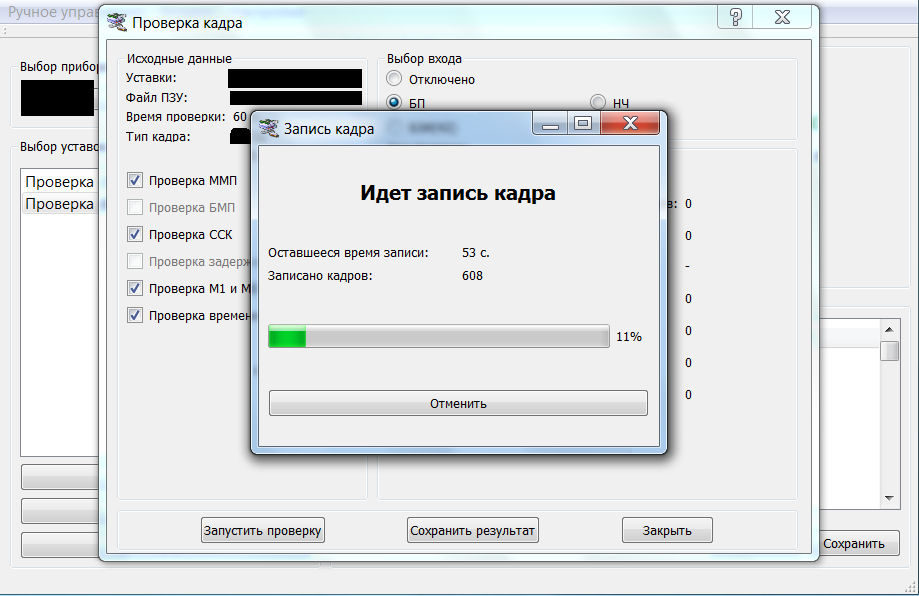
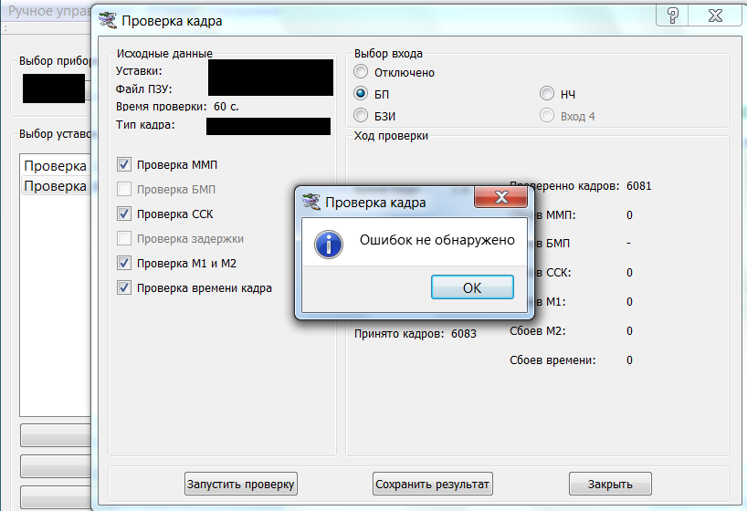

# Автоматизированная обработка телеметрических сообщенией КА

В этом репозитории находится ПО для тестирования прибора ОКФ
основной алгоритм (создание эталонного кадра) находится в файле:
`dcheckkadr.cpp`

## Работа программы

  

  

  

  

